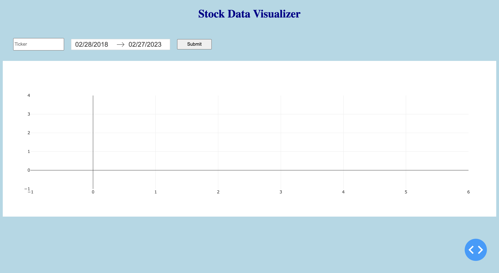
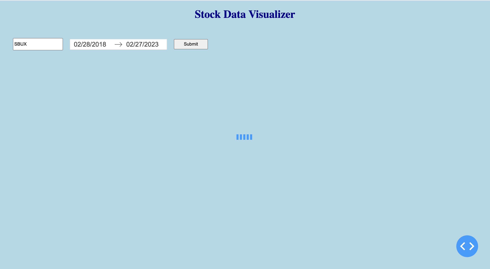

# Stochastic-Time-Series-Modeling

Code to explore Stochastic Time Series Modeling applied to stock data.

## Running Webapp

1. `python app.py`

2. Type in a Ticker (i.e. SBUX, KO, SPY, etc.) and hit Submit (takes about ~20s)

3. View historical daily closes on the left and a one year out projection of 500 scenarios

