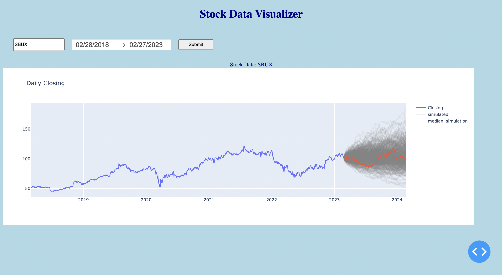

# Stochastic-Time-Series-Modeling

Code to explore Stochastic Time Series Modeling applied to stock data.

## Running Webapp

1. Run `python app.py` in terminal. You should see something popup that says 
`Dash is running on http://127.0.0.1:8050/`. Copy and paste this link to your 
favorite browser. You should land on the following page.

2. Type in a Ticker (i.e. SBUX, KO, SPY, etc.) and hit Submit (takes about ~20s)

3. View historical daily closes on the left and a one year out projection of 500 scenarios

